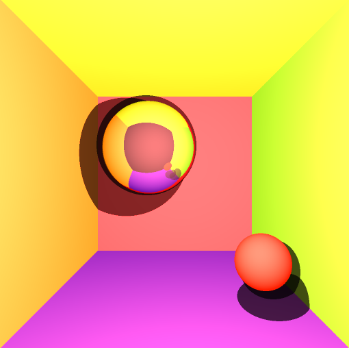

## Ray Tracer in C++ 
This project implements teaching frameworks for an introductory computer graphics course.

1. Class **"Image"** implements a simple matlab-like syntax for generating/showing/saving images. The image is shown on screen using GLFW and openGL. The image is saved to disk using libpng and zlib.
 
2. Class **"Canvas"** implements a simple warpping over GLFW3. Students can simply fill in a few callbacks in main.cpp.

This framework has been tested on the following platforms :

- OSX Yosemite 10.10.5 + XCode 7.0.1 Build &A1001
- Windows 10.1 + Visual Studio 2013 Community (VS12)

To run this framework on any other platforms, the required libraries need to be recompiled according to the target OS.

### Description of what have been implemented:
The program ourputs an image that renders:
  * Cornell boxen closing the scene
  * Two spheres
  * Diffuse shading
  * Hard shadows
  * Reflections
  * Two light sources
  * Jittering

### Image output:

